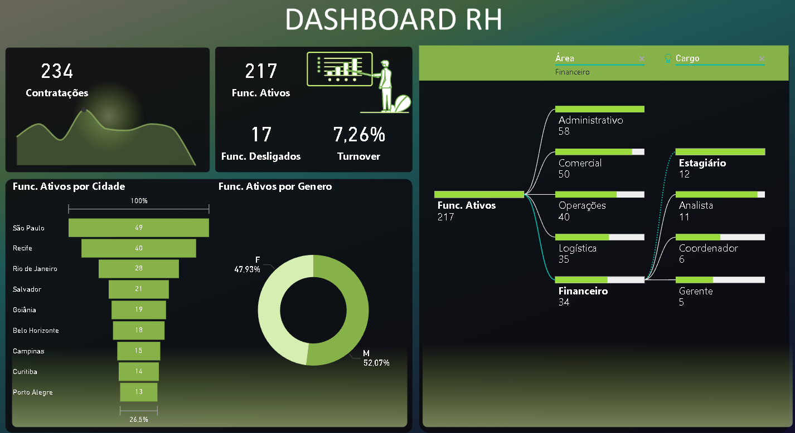

# 📊 Dashboard de RH - People Analytics | Power BI

## 📌  Sobre o Projeto

Este projeto foi desenvolvido com o objetivo de analisar dados de Recursos Humanos e gerar insights estratégicos sobre o quadro de colaboradores.

O dashboard permite acompanhar indicadores essenciais como turnover, contratações, desligamentos e distribuição organizacional, auxiliando na tomada de decisão orientada a dados (data-driven).

## 🎯 Objetivo de Negócio
Fornecer uma visão clara e interativa sobre a força de trabalho da empresa, permitindo:

Monitorar a retenção de talentos
Identificar áreas com maior rotatividade
Analisar a distribuição de colaboradores
Apoiar estratégias de recrutamento e gestão de pessoas

## 🗂️ Base de Dados
O dataset simula um ambiente corporativo e contém informações como:

Funcionário
Cidade
Área (Administrativo, Comercial, Operações, Logística, Financeiro)
Cargo (Estagiário, Analista, Coordenador, Gerente)
Gênero
Data de Admissão
Data de Desligamento
Status (Ativo/Inativo)

## 📈 Indicadores (KPIs)

O dashboard apresenta os seguintes indicadores principais:

234 Contratações
217 Funcionários Ativos
17 Funcionários Desligados
7,26% de Turnover

## 🔍 Análises Desenvolvidas
👥 Distribuição por Cidade
Identificação das localidades com maior concentração de colaboradores, permitindo análise geográfica da força de trabalho.

## ⚖️ Distribuição por Gênero
Avaliação de diversidade, mostrando equilíbrio entre colaboradores masculinos e femininos.

## 🏢 Estrutura Organizacional
Análise hierárquica dividida em:

Áreas
Cargos dentro de cada área

Facilitando a visualização da composição organizacional.

## 📊 Análise de Turnover

Monitoramento da taxa de rotatividade, indicador essencial para avaliar retenção de talentos.

## 💡 Principais Insights
A maior concentração de colaboradores está em São Paulo
A empresa apresenta equilíbrio de gênero (~50/50)
As áreas Administrativa e Comercial concentram maior número de funcionários
O turnover de 7,26% indica um nível relativamente controlado de rotatividade

## 🛠️ Ferramentas Utilizadas
Power BI (modelagem e visualização)
Excel / CSV (tratamento e estruturação dos dados)

## 🧠 Habilidades Demonstradas
Análise exploratória de dados (EDA)
Construção de dashboards interativos
Definição de KPIs de negócio
Storytelling com dados
Modelagem de dados no Power BI

## 📊 Visual do Dashboard

## 📁 Arquivo

O arquivo `.pbix` está disponível neste repositório para download.
